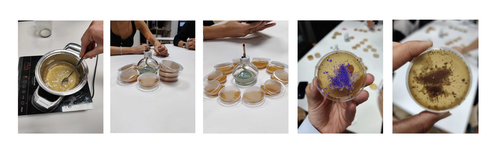
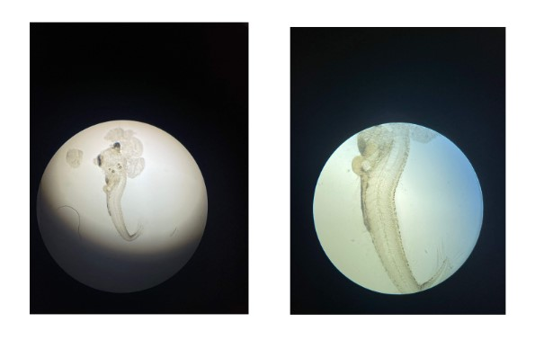
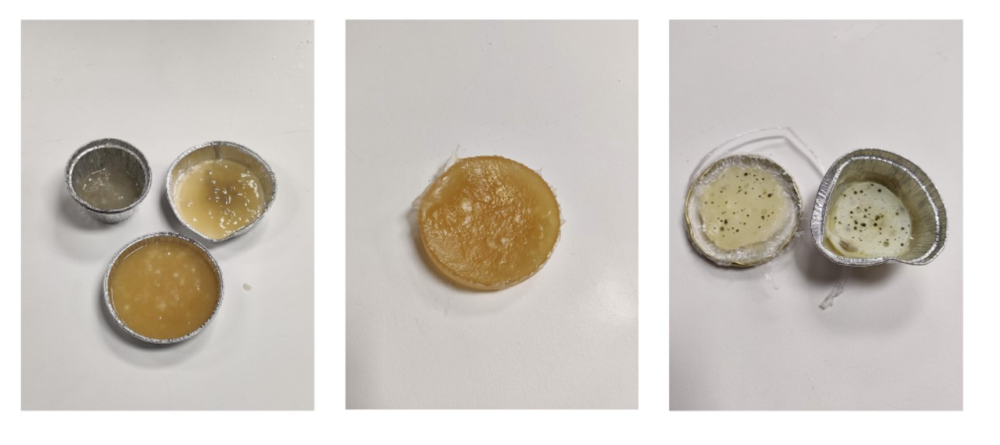
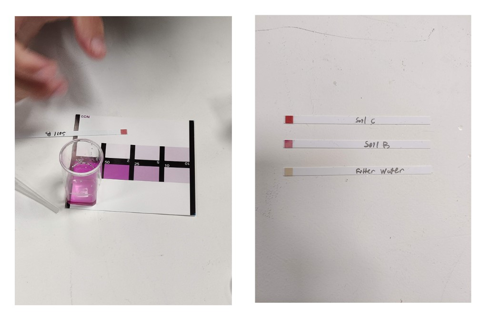

# Bio and Agri Zero

EXPERIMENT 1- MICRO-BIOLOGY

Divided into groups and all having different recipes, we had to create our own  DIY  bacteria . Adding micro-organism from around the environment- I added CHALK POWDER in my dish and after one day, there were bacterial colonies visible around the corners.

EXPERIMENT 2- MICROSCOPY

3 different microscopes- the microscope, the digital microscope and the microscope lens which could be attached on the mobile phone- were introduced to us and we had the chance to look at some of the micro-organism samples that were bought to class.

EXPERIMENT 3- BIO-PLASTIC

We created our own bio plastic using distilled water, carbon source, glycerol and acid. 

EXPERIMENT 4- CONCENTRATION OF SOLUTIONS

To check the alkaline value of nitrate, we used different waters from the different soils. These were the results for the same.

###NEWS ARTICLE

[Article](https://www.newscientist.com/article/2344593-vaccines-that-prolong-the-immune-response-may-give-better-protection/)

