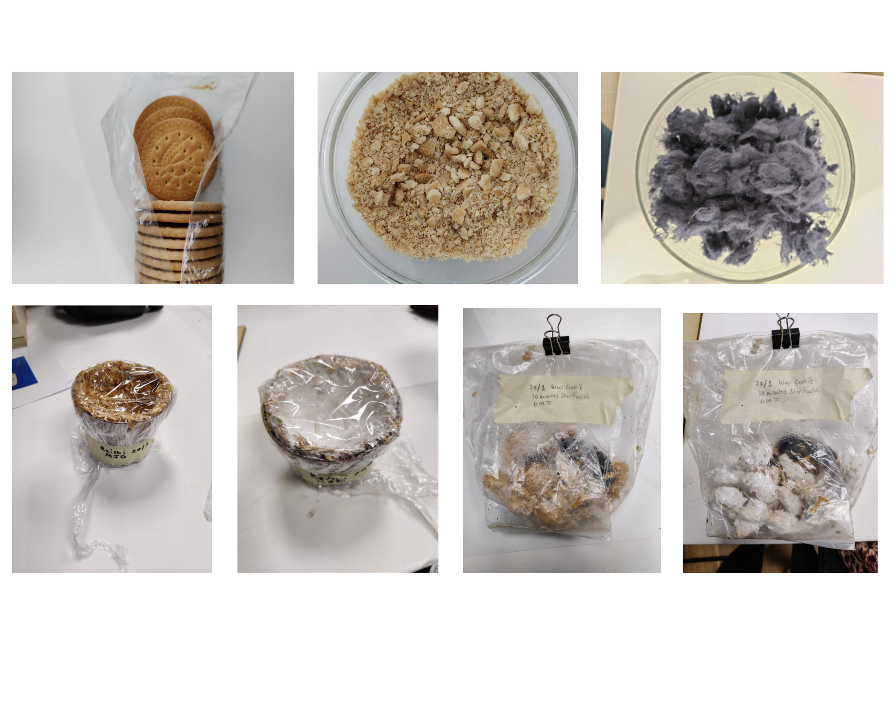

#REMIXING MATERIALS

###Assignment: MATERIAL NARRATIVE 

[Material Narrative](https://www.canva.com/design/DAFYbK_vuJI/view)

Making materials during the lecture series:

1. Using locally sourced materials from the neighbourhood- wood and wool:

2. Using Mycellium:

3. Experimenting with 3D technology:

Exploring new Materials:

[Remixing Material Final Presentation](https://docs.google.com/presentation/d/1keYlu8yUO7T16X5iwzkFBpeWxS9YIwIQEn_LoPX0DVc/edit?usp=sharing)

<iframe src="https://docs.google.com/presentation/d/e/2PACX-1vTz5bQZxYCoqLEoDq1Hn4jbpD87qWg8lrPWTrcoUoomhz210a7lvriToydV1hP8XgZtj1SwN0PYDwOi/pub?start=false&loop=false&delayms=3000" width="640" height="480" allow="autoplay"></iframe>