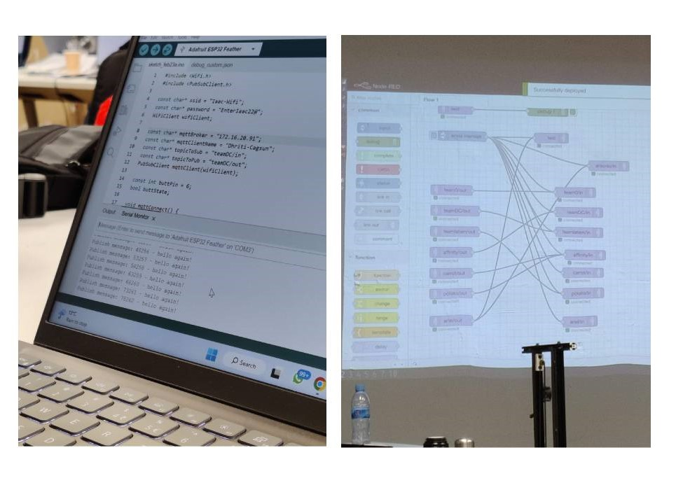

#Digital Prototyping for Design

##Daily Reflection:

###WEEK 1:

01.02.2023:

(ELECTRONICS AND CODING)

After a brief introduction to Arduino and electronics, experimented with Arduino and a buzzer to create some music;

[EXPERIMENT 1- A tune](https://youtube.com/shorts/0zyrE2FXnRI?feature=share)

[EXPERIMENT 2- Game of Thrones tune][def]

**listen on full volume

[def]: https://youtube.com/shorts/J33XcJMvgLg?feature=share

---

02.02.2023:

(DESIGN TOOLS- 2D,3D and Parametric design)

Today was an introduction to all basic concepts and then insights into different softwares for 2D modeling, 3D modeling and Parametric modeling.

for today's exercise- I tried building a Parametric structure using grasshoper on Rhino.

---

###WEEK 2:

08.03.2023:

(Bi-Dimensional Fabrication)

Today was all about Laser Cutting and Vinyl Cutting. After deep isights into their histories, usages, properties and different projects; we had a demo on these 2 machines in the FabLab.

the exercise for today was to fabricate a small prototype with the lasercutter for pressfit models or to lasercut a mold for bioplastics.

I, being an Interior design student have had some expereince with lasercutting but my outputs have always been relatively simpler, but for this class, I wanted to use lasercutting to create a more complex object.

---

09.03.2023:

(INPUTS and OUTPUTS)

It was a very informative session relating to electronics, sensors, understanding the functioning of pullupd and pulldowns, inputs and outputs.

The assignment for today was to use LDR(Light Dependent Resistor) and Actuating Light and to test the morse code.

[testing Morse Code](https://youtube.com/shorts/orA1_hNNjDY?feature=share)

---

###WEEK3 (microchallenge1):

MICROCHALLENGE 1:

Project:

Antonio and I, paired up for this micro challenge week with our own interests in mental health, wellness and physical health respectively. Understanding your body and it’s responses is what drives both of our projects and taking forward this idea, we built a first model that would help us not only collect data from our bodies but also understand and reflect on them.

Bio Sensing -HRV( Heart Rate Variability) is where the amount of time between your heartbeats fluctuates slightly. These variations are very small, adding or subtracting a fraction of a second between beats. It changes every second depending on what you’re doing, how you’re feeling.

Using HRV to read you’re body and understand it’s state and presenting it in a visual form- was the main concept for our micro challenge week.

We created a device that when connected to a person, reads the HRV via the ECG sensors and translates that information into different color based on the Aura color chart that highlights every color with a respective energy and being displayed on the sculpture which when seen from different angles, represents the orb shape.

[Repo link for our project] (https://github.com/dhritidhoka/Microchallenge1.git)

My Contribution towards this project:
 

After a deep research and exploring the idea of using HRV, we started working on the project together on every step as both of us had interest in all the aspects of developing this project, but with the time limitation, we divided the work.
 
I worked on the design aspect of the project - from creating multiple designs on Rhino, rastering it using lasercut machine, re-iterating them constantly.

After many designs prototypes, when we both agreed on the best design, I started building it but faced multiple challenges- from having to change the design, the design sizes because it would it take a very long time to be cut and then waiting for my turn to use the lasercut machine and then the machine not working in my favor.

The base structure was another aspect that we both worked on together. We had to create a wooden base and a bio material base using pine resin and coffee grounds.

The documentation of the process was something we both contributed towards along with creating a repository for the same.

My learnings:

This micro challenge week had me on my toes, I learned alot during this week and made me realized how much I have learned here- from coding to designing to managing and developing the project all at once. This week had me dig deeper into electronics and coding to which I had not had much of experience and let me reconnect with my designing skills. 

The project idea seemed really straightforward initially but as we started building it, we encountered alot of challenges and pauses we didn't anticipate but helped us learn more.

It was a great week for me, I learned alot from the FabLab and working with Antonio on an idea to which we both believe in, made it even more worthwhile. We both would like to continue building the project further and make it not only useful for us in our projects but also the people, making them aware of their body’s responses.

---

DAILY REFLECTIONS:

14.02.2023(Tuesday):

The first day was just about forming and group and working together on the ideas and planning the project and its stages. Antonio and I grouped up and spent the entire day sharing ideas and exploring different project possibilities and planning the project phases.

15.02.2023 (Wednesday):

We started the day with finalizing the idea and working on the concept and developing the first design prototype while also looking into the electronics and coding aspects of the project.
By the end of the day, we had a first design prototype ready and had already starting figuring out the sensors.

16.02.2023 (Thursday):

 The agenda for today was to have the entire final outcome ready so as to spend the next day just on the repo. But it didn't go as planned. I spent alot of time making the final design while Antonio was focused completely on the electronics part.  Even after having the design ready, we didn't get a chance to use the laser cut machine until the last hour and when we did, the machine was not responding and was getting disconnected constantly. While we were also struggling with the sensors- it worked the first time perfectly but not anytime after that.

By the end of the day, we didn't have any design ready and printed, the base structure was not ready and neither was the electronics of it sorted.

17.02.2023 (Friday):

The first thing I started working on was getting the design cut using the lasercut machine and as that was being done, I started working on making the base structure while Antonio was completely focused on resolving the electronics part. By the beginning of the final presentation, we had the model ready and working. 
It was a very stressful day knowing that we didn't have anything in the beginning of the day but by the afternoon we had everything as we planned.

---

###WEEK4:

22.02.2023:

(NETWORKING)

today was a very imformative sesiion for me, we touched based with several important topics like-

-Networking for data/information flow

-What are network and why is it important or needed

-Protocols and networks

-Protocol for communication

-Wired communication/ serial communication

and lastly we spent an hour or so trying connect to each others laptop via a MQTT server connected through our ESP32 wifi and try sending messages across.

---

23.02.2023:

(3D FABRICATION and SCANNING)

From starting with in depth 3D printing- history to its evolution and technologies, we then also looked into 3D scanning and its history, tech and amazing exmaples.

The assignment for today was to 3D scan an object and then then 3D print it or the other way around.

I chose the other way around, where i 3D printed and then 3D scanned it. By doing this way, I also got a chance to use the 3D modelling softwares again.

I created a twisted column with bricks on Rhino and then 3D printed it and then scanned it to have it back as a mesh model.

---

###WEEK5:

01.03.2023:

(INTERFACES-Machine vs Machine)

Interfaces- machine vs machine was a very interactive and hands on session where we strated with a simple blink and increasing the complexity with every step leading until having LED controlled with sensors using MQTT broker.

the documentation for the same is as below:

[INTERFACES](https://www.canva.com/design/DAFcCdC47qA/view)

02.03.2023:

(CNC-Computer Numerical Control)

