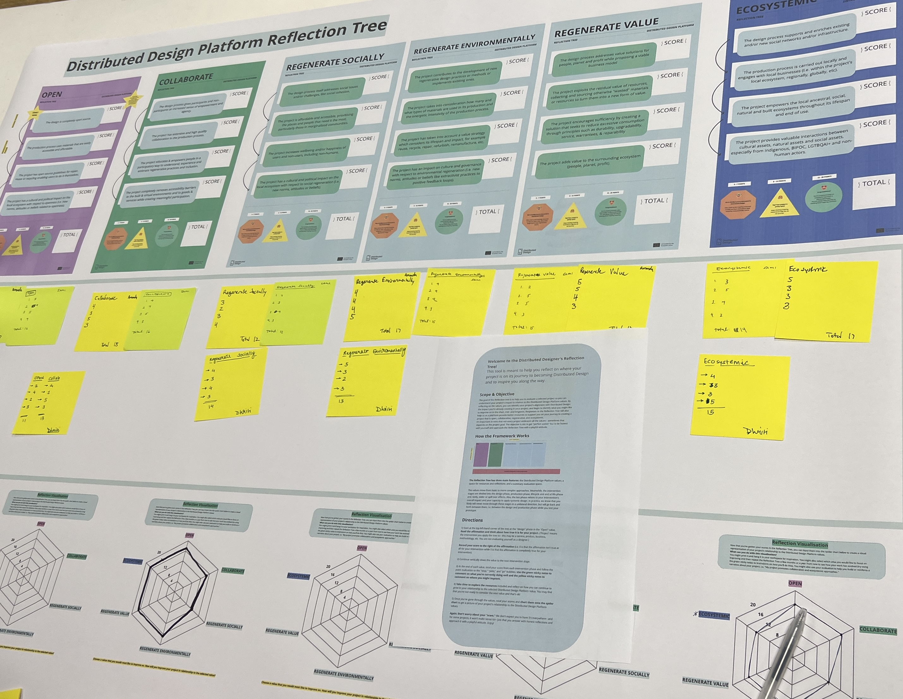
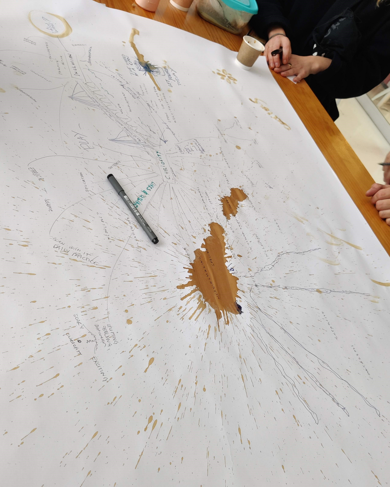

#Distributed Design

##Daily reflections:

###MUSHROOM MODEL:

For this exercise, we chose the topic of FERTILIZER PROCESS.
We started with the making process and then moved to knowledge and values and ended up at power.

LEARNING SKILLS:
 This was a great exercise to get us started with understanding the important roles power, knowledge, values and process hold in developing any design or solution while taking into account the stakeholders and other influencing aspects.

DYNAMICS:
 There was an open discussion about fertilizers and with everyone coming from different backgrounds and cultures, there was a lot to be shared and to understand with each other and trying to find similarities and differences between different practices for the same fertilizer and their production processes.

INTERACTIONS:
 The different perspectives and insights into the same practices but in different locations, did influence my perspective. I got a deeper understanding of how and what procedures were followed.

---

###REFLECTION TREE:

This exercise was a deeper dive into knowing of your personal projects and reflecting on them with the help of the reflection tree and sharing our experiences within a small group of few students.

LEARNING SKILLS:
 This was rather difficult as it really made me reflect on my project and the values I have been considering or not, making me realize the values that I didn't have in the back of my mind while working on my project. 

DYNAMICS:
 After individually scoring ourselves based on the values, we had a discussion amongst ourselves where there was complete positive energy with everyone passionately talking about their projects and about what values we are strongly applying and what values we would like to focus on or improve our projects in those areas as well.

INTERACTIONS:
 There were many ideas and feedback that were shared and it did give me a fresh perspective about my project which would help me see through a new lens and add more value to my project.

---

###VALUES:

This exercise was a tool that helped reflect on what are the values that lie on the top for us and formed a group with students with similar values and having a tool to express the importance of that value.

LEARNING SKILLS:
 There was a lot of conversation and different views on CURIOSITY and INCLUSION. This was a free space for us to express our thoughts and communicate the idea and the meaning behind it while also recovering a great knowledge of it through different takes on it.

DYNAMICS:
 The group had a really open and free dynamic where everyone expressed their thoughts while having conversations about curiosity and inclusion and sharing a cup of coffee to draw on the huge sheet of paper to express and use it as a fun way to include it in our sheet of words.

INTERACTIONS:
 This was really informative for me, I did get a lot of knowledge and a new perspective on curiosity and inclusion which I was not aware about.
