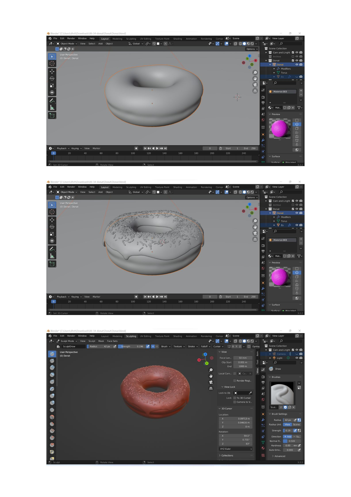

#Prototyping for Design

##Daily reflections:

---

19.04.23

###Robots:

 In this class, we started learning about different kinds of robot arms that exist nowadays, the motors they use, the amount of axis they have, the end effectors one can use, and some techniques and applications commonly used such as 3D printing, milling, cutting and automation. A very informative session about robotic arms. We learnt about robotic arms and how to prepare its file on Grasshopper. Through Grasshopper we saw how to create simulations and played around with scripts to see how the parameters could be controlled and modified.
 We did an experiment as a class where we printed “MDEF” using the robotic arm.

 

 I tried using the robotic arm library and using it on grasshopper- here are some of the views of it:

--- 

20.04.23

###Blender:
 A software that I have some knowledge of but this was a very productive lecture for me, it highlighted the importance of blender and the different possible fields it can be used for. Victor also shed light on how essential it is to select a tool that allows for easy learning while also providing the freedom to accomplish desired outcomes. Acquiring proficiency with tools such as Blender provides the user with the autonomy to design with greater flexibility. Modifying the tool itsself should be a normal part of the creative process to allow a wider range of outputs. Blender as known to me before was a very direct tool but after this lecture, I was amazed to see the endless opportunity it porvides it knowing the right paths for it.

I followed a youtube video to create a donut- [youtube reference video link](https://youtu.be/K9szzrOfslU)

 

---

26.04.23

###Live Coding as Human Interface:

 This session was a very interactive hands-on session where we were introduced to Hydra and how to create illustrations using live coding by playing around with different parameters and obtaiong live illustrations.

 
 
---

27.04.23

###Blender as Interface:

After getting the basics in the last blender session, we were introduced to python in blender. Python is a progammimg language that can also be used as a way to design in Blender.
We tried some basic tools in blender using python such as array:

 

Next Victor showed us to connect our smartphones to Blender and allow real time movement and reflection in blender(we did not try it out)

And the last was where we connected a Led strip light and connected it to  blender where with the movement of the mouse, the led lights blinked.

 

 ---

 16.05.23- 19.05.23
 
###MicroChallenge 3:

I could not take part in the Microchallenge 3 week as I was travelling but will compensate for it with other challenege!

