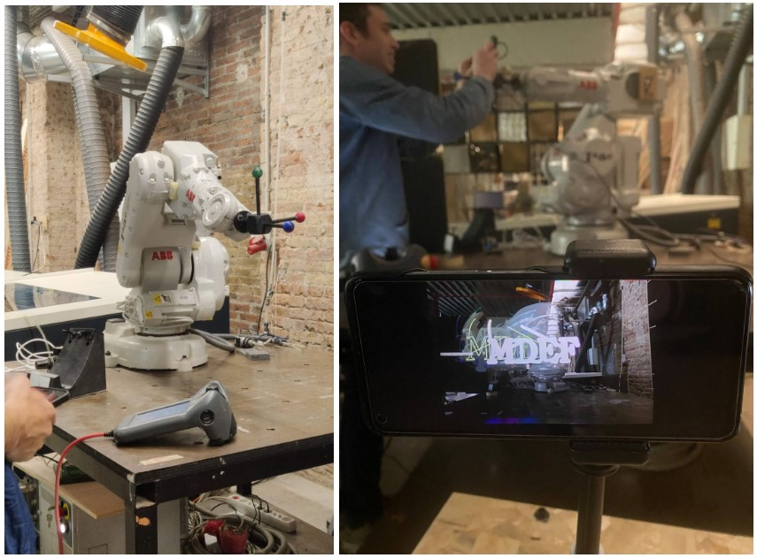

#Prototyping for Design

##Daily reflections:

---

19.04.23

###Robots:

A very informative session about robotic arms. We learnt about robotic arms and how to prepare its file on Grasshopper.
 We did an experiment as a class where we printed “MDEF” using the robotic arm.

 

--- 

20.04.23

###Blender:
 A software that I have some knowledge of but this was a very productive lecture for me, it highlighted the importance of blender and the different possible fields it can be used for.

---

26.04.23

###Live Coding as Human Interface:

 This session was a very interactive hands-on session where we were introduced to Hydra and how to create illustrations using live coding:

 
 
---

27.04.23

###Blender as Interface:

After getting the basics in the last blender session, we were introduced to python in blender.
We tried some basic tools in blender using python such as array:

 

Next Victor showed us to connect our smartphones to Blender and allow real time movement and reflection in blender(we did not try it out)

And the last was where we connected a Led strip light and connected it to  blender where with the movement of the mouse, the led lights blinked.

 

