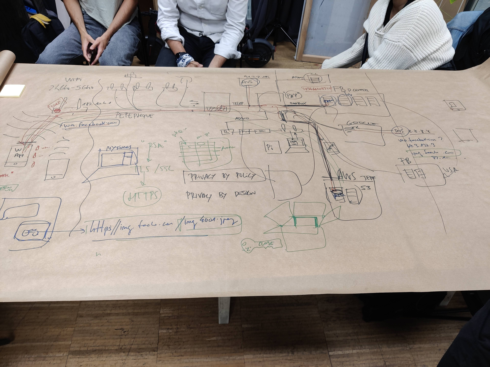
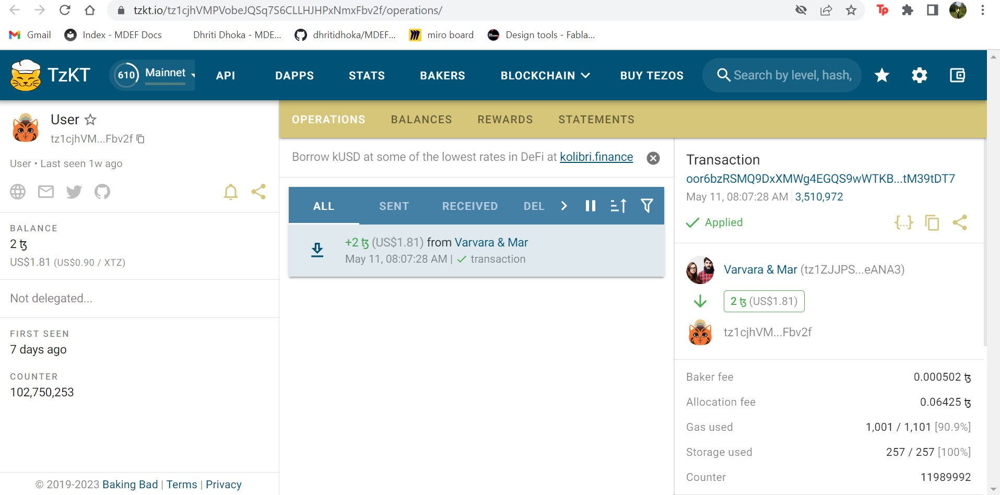

#Decentralized Autonomous Organizations

##Reflections:

04.05.23 

Session with Guillem:

A key insight that arose from the session was the understanding that protocols and platforms extend beyond mere engineering artifacts. They are social constructs that facilitate communication and collaboration among individuals. These tools shape our interactions and decision-making processes.

Overall, this session enabled me to perceive technology as a tangible and material reality intricately interwoven with social, political, and environmental concerns. By comprehending the inner workings of digital protocols and platforms and adopting a critical and reflective approach toward technology, we can embark on designing and constructing more sustainable and equitable futures.
Understanding the technologies we use requires a substantial investment of time, energy, and effort. Technology permeates all our interventions, whether they are digital or manual, and every decision we make, consciously or not. Websites, interfaces, drives, and documents are all part of this process. However, it is crucial to remember that "technologies are cultural artifacts." Any sufficiently advanced technology may seem indistinguishable from magic, emphasizing the need to grasp its cultural significance.

Collective intelligence is another area of focus. We transitioned from a simple network to the concept of Web 2.0. Initially, we believed the internet and the web would be distinct from traditional economies, emphasizing open-source collaboration. However, when discussing collective intelligence, we must also consider the platforms and companies that facilitate these technologies.

10.05.23- 12.05.23

Sessions with Mar:

Blockchain is a decentralized digital ledger that records transactions across multiple computers or nodes. It ensures transparency, security, and immutability by creating a chain of blocks that contain transaction data. Each block is linked to the previous one through cryptographic hashes, forming a tamper-resistant and distributed system.

Cryptocurrency is a digital or virtual currency that uses cryptography for security and operates independently of a central bank. It leverages blockchain technology to enable secure and transparent transactions. Examples of popular cryptocurrencies include Bitcoin, Ethereum, and Litecoin.

A wallet in the context of cryptocurrency refers to a digital tool or software that allows users to store, manage, and interact with their cryptocurrencies. It stores the private keys needed to access and authorize transactions on the blockchain. Wallets can be software-based or hardware-based.

Temple Wallet is a specific type of cryptocurrency wallet designed specifically for Tezos (XTZ), which is a blockchain platform that supports smart contracts and decentralized applications (DApps). Temple Wallet provides users with a secure and user-friendly interface to manage their Tezos funds and interact with Tezos-based applications.

 

NFT stands for Non-Fungible Token. It is a type of digital asset that represents ownership or proof of authenticity for a unique item or piece of content, typically on a blockchain. Unlike cryptocurrencies, which are fungible (interchangeable with each other), NFTs are distinct and cannot be exchanged on a one-to-one basis. They are often used to represent digital artworks, collectibles, virtual real estate, or other unique digital assets.

NFT markets are online platforms or marketplaces where NFTs are bought, sold, and traded. These platforms provide a space for artists, creators, and collectors to showcase and trade their NFTs. Some popular NFT marketplaces include OpenSea, Rarible, SuperRare, and NBA Top Shot. These markets have gained significant attention and popularity in recent years, driving the growth of the NFT ecosystem.

##Deliverables:

The project can range from a NFT collection, to a white paper or presentation of an idea for a project using web3 (like a DAO or new cryptocurrency or any other idea that connects to the topics cover in the course).

[Web3.0]](https://docs.google.com/presentation/d/18VixHvlcsFFaN-tWnM4pBRLL3NX6OSf6m737kPGrYvE/edit?usp=sharing)
